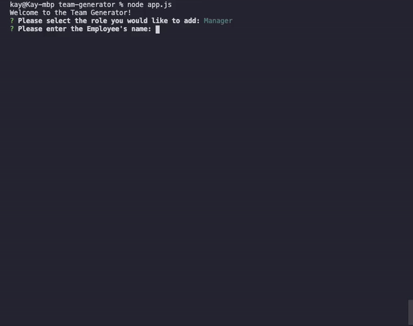
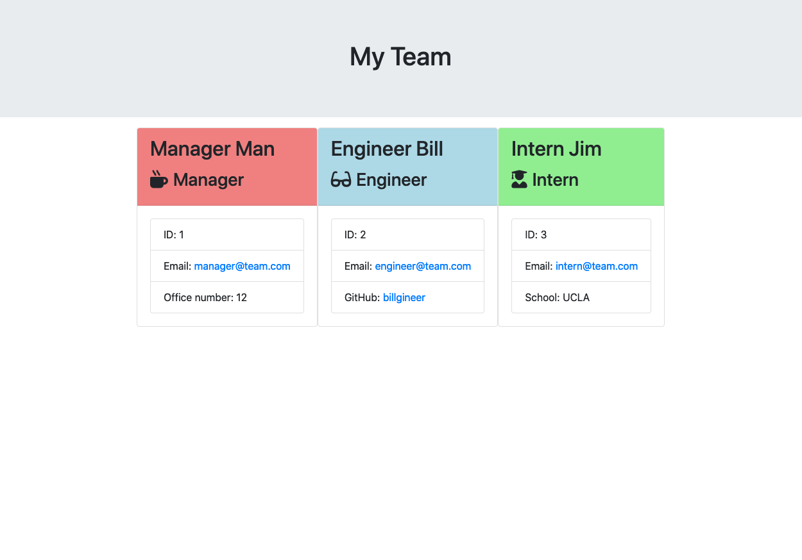

# Team Generator

            
## Description
JavaScript application that takes user input in terminal and generates a web application that displays team members and information about each

## Table of Contents
* [Installation](#installation)
* [Usage](#usage)
* [License](#license)
* [Shoutouts](#shoutouts)
* [Contact](#contact) 

## Installation
`npm install`

## Usage
`node app.js`

## License
This application covered under the MIT License

## Shoutouts
Talking through some things with [Bing](https://github.com/imbingz) helped me get a better handle on things

## Contact
Github: [theykay](https://github.com/theykay)

Email: [murraykyleb@gmail.com](mailto:murraykyleb@gmail.com)